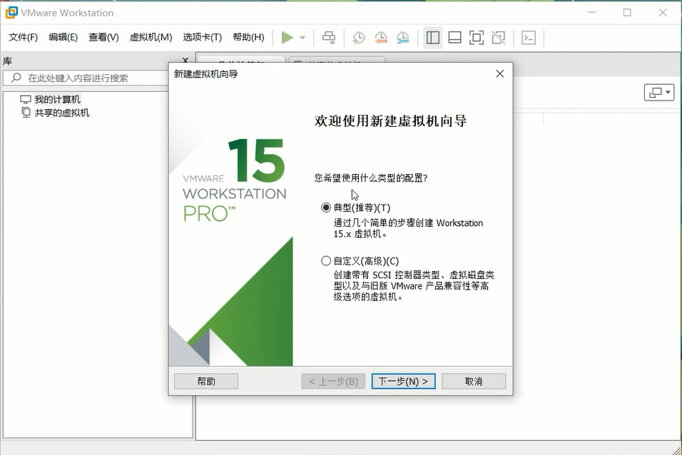
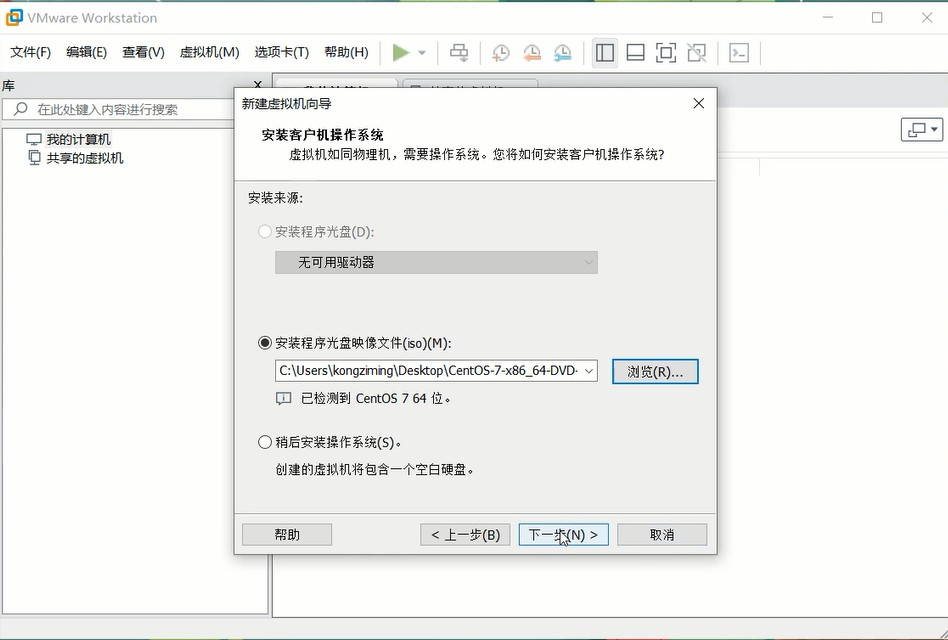
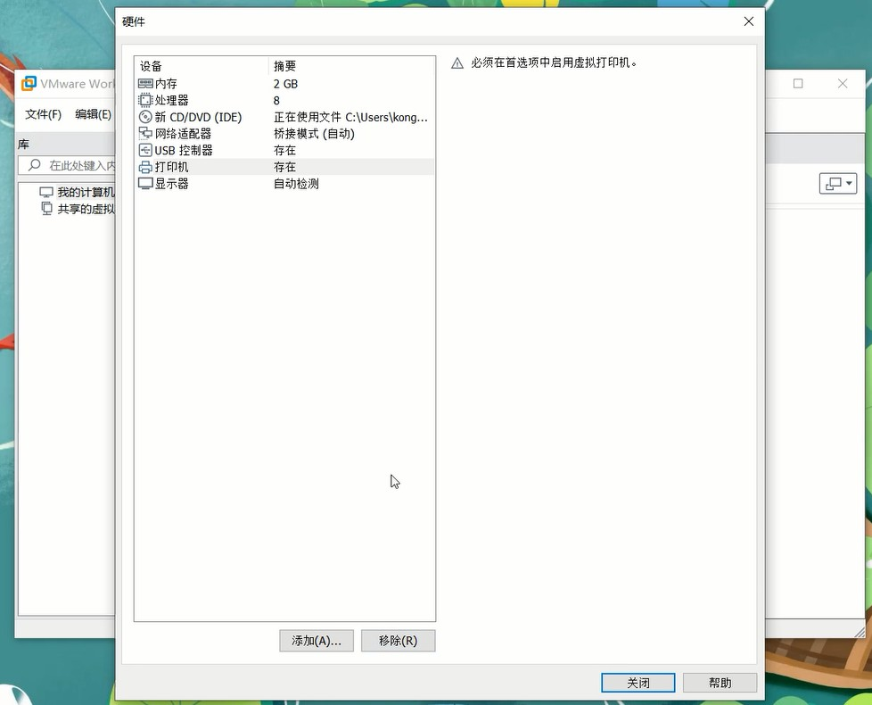
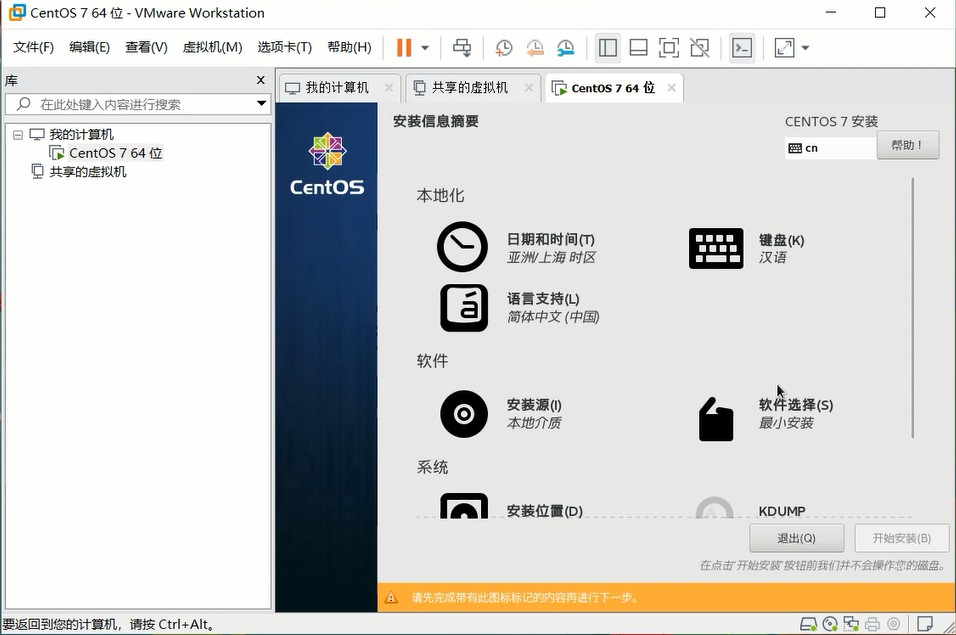
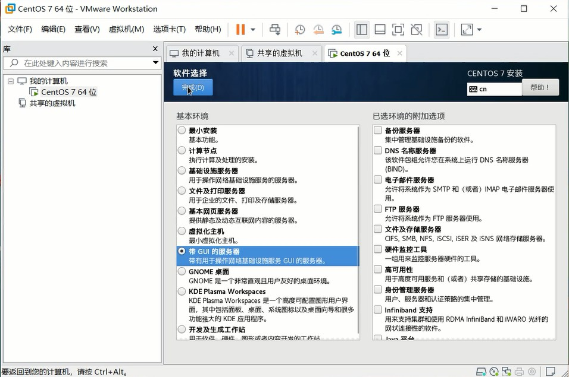
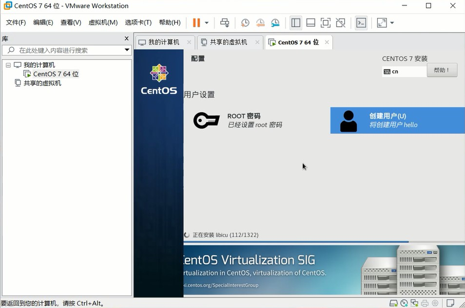
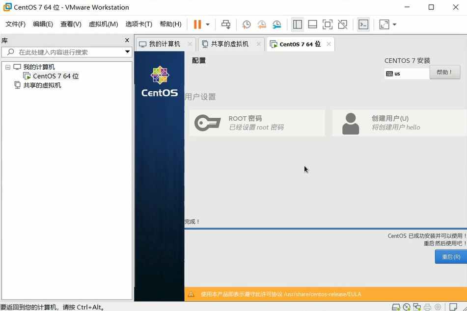

# 通过windows搭建gitlab

## 痛点

在搭建gitlab之前，请先思考以下几个问题：为什么会选择git而不用svn？应该选择哪种适合自己或团队的git服务器？想要搭建gitlab是否因各种难题甚至想要放弃？

[不同git服务器对比](https://www.slant.co/topics/1440/~best-self-hosted-web-based-git-repository-managers)

有时候我们不想把代码托管在外网上，想在内网搭建一个git服务器，该如何选择呢？

可能大家会从团队人数、硬件等方面考虑，我选择gitlab的原因是它有非常美观的web界面，而且功能很强大。但是搭建起来有点麻烦，尤其是在windows上。


## 在windows中搭建gitlab

在windows中搭建gitlab可能并非一件易事。

### (一) 使用Docker

第一种方法是通过`docker`，首先安装[docker for windows](https://hub.docker.com/editions/community/docker-ce-desktop-windows)，接下来在docker中搭建gitlab，[参考这里](https://docs.gitlab.com/omnibus/docker/)。

在网上有很多教程，比如这篇：[win10企业版在docker上部署gitlab](https://blog.csdn.net/MonoBehaviour/article/details/84852984)，按照教程一步一步确实是可以运行gitlab并且可访问的。

然而，这种方式是存在风险的。gitlab官方[文档](https://docs.gitlab.com/omnibus/docker/)中并不推荐，主要因为存储权限和其它一些未知问题，最严重的是它不支持持久化存储，当你的服务器重启之后，gitlab中的所有数据都会丢失。而且我没有找到好的解决办法。

所以，这种方法目前是**不可取**的。

### (二) 使用虚拟机

第二种方法是通过在虚拟机中运行一个linux系统来搭建gitlab，我使用的是[VMware](https://my.vmware.com/cn/web/vmware/info/slug/desktop_end_user_computing/vmware_workstation_pro/15_0) + [CentOS](https://www.centos.org/download/)。

该方法主要分为3步：

1. 在VMware中安装CentOS系统
2. 在CentOS中安装gitlab
3. 网络配置，使得局域网内可访问gitlab

下面将对这3个步骤作详细介绍——


## 步骤一：在VMware上安装CentOS

1. 打开VMware，新建虚拟机 - 典型 - 安装程序光盘映像文件
   

2. 选择CentOS系统文件
   

3. 自定义硬件

   增加内存到2G

   调整处理器数目

   网络连接可选择桥接模式，也可以选择NAT模式。在后面需进行配置

   删除声卡选项

   其它不变

   

4. 开始安装
   

5. 软件选择中，选择带GUI的服务器，这样在安装完成后会带一个界面，方便后面操作。
   

6. 设置ROOT密码，创建用户
   

7. 完成安装，重启

   

   至此，CentOS便安装成功了。

   

## 步骤二：在CentOS中安装gitlab

在CentOS等Linux系统中安装gitlab，可参考[官方教程](https://about.gitlab.com/install/#centos-7)。下面是一些详细说明：

### (一) SSH

安装ssh

```shell
sudo yum install -y curl policycoreutils-python openssh-server
```

将ssh服务设为开机自启动

```shell
sudo systemctl enable sshd
```

开启ssh服务

```shell
sudo systemctl start sshd
```

### (二) 防火墙

安装防火墙，如果已安装了防火墙，则可跳过这一步

```shell
yum install firewalld systemd -y
```

开启防火墙

```shell
service firewalld start
```

将http和https添加到防火墙，permanent表示永久生效

```shell
sudo firewall-cmd --permanent --add-service=http
sudo firewall-cmd --permanent --add-service=https
```

重启防火墙

```shell
sudo systemctl reload firewalld
```

### (三) Postfix

接下来，安装Postfix用来发送通知邮件。如果你想使用其它方法来发送邮件，可以跳过这个步骤，并在Gitlab安装完成后配置SMTP服务。

以下分别是安装、设为自启动以及开启。

```
sudo yum install postfix
sudo systemctl enable postfix
sudo systemctl start postfix
```

### (四) 安装gitlab

在这里，我们需要通过wget来下载gitlab安装包，如果wget没有安装，则可通过下面的命令安装：

```shell
yum -y install wget
```

此外，你可能还需要安装vim，因为后面需要修改gitlab的配置文件：

```
yum install vim -y
```

接下来是下载gitlab安装包，为了保证下载速度，可以从[清华大学开源软件镜像站](https://mirrors.tuna.tsinghua.edu.cn/)下载

```shell
wget https://mirrors.tuna.tsinghua.edu.cn/gitlab-ce/yum/el7/gitlab-ce-11.11.8-ce.0.el7.x86_64.rpm
```

安装gitlab

```shell
rpm -i gitlab-ce-11.11.8-ce.0.el7.x86_64.rpm
```

### (五) 修改配置

等待gitlab安装完成后，终端界面会提示你修改`/etc/gitlab/gitlab.rb`文件，通过设置`external_url`l来配置你的URL，通常情况下是你的服务器ip和端口号。

```shell
vim /etc/gitlab/gitlab.rb
```

终端界面还提示你通过下面的命令启动gitlab：

```shell
sudo gitlab-ctl reconfigure
```

到此为止，你在CentOS中的浏览器输入 http://localhost 或者 ip及端口号，便可以看到gitlab的页面了。


## 步骤三：配置网络，使得局域网内可访问

如果你的VMware虚拟机网络适配器选择的是“桥接模式”，那么只需在CentOS中设置一个静态IP，以后局域网内便可通过该IP访问gitlab。(也许可以不用设置静态ip，我没有试过虚拟机每次重启，ip会不会变化)。

如果你的VMware虚拟机网络适配器选择的是“NAT模式”，那么需要配置网络端口转发，即将主机的端口与虚拟机的端口关联起来，今后访问主机IP便可间接访问到虚拟机中的gitlab。

关于桥接模式和NAT模式的区别，可参考[这篇文章](https://blog.csdn.net/ning521513/article/details/78441392)。

### (一) 设置静态IP

在CentOS 7中，通过以下命令编辑IP：

```shell
vim /etc/sysconfig/network-scripts/ifcfg-ens33
```

修改如下，注意其中加注释的几处

```
PROXY_METHOD=none
BROWSER_ONLY=no
BOOTPROTO=static		# 使用静态IP地址，默认是dhcp
IPADDR=192.168.5.122	# 设置的静态IP
NETMASK=255.255.255.0	# 子网掩码
GATEWAY=192.168.5.2	    # 网关
DNS1=192.168.5.2		# DNS服务器
DEFROUTE=yes
IPV4_FAILURE_FATAL=no
IPV6INIT=yes
IPV6_AUTOCONF=yes
IPV6_DEFROUTE=yes
IPV6_FAILURE_FATAL=no
IPV6_ADDR_GEN_MODE=stable-privacy
NAME=ens33
UUID=8df5a6e0-cba0-4f89-b55c-319d2616a985
DEVICE=ens33
ONBOOT=yes
ZONE=public
```

注意：在NAT模式下，这里设置的静态IP网关不要与主机的网关相同。

最后，重启网络使刚才配置的IP生效

```shell
service network restart
```

### (二) 配置NAT模式网络端口转发

打开VMware菜单，编辑 - 虚拟网络编辑器 - NAT设置。


## 常见问题

最后，总结一下安装过程中的常见问题和解决办法

1. 虚拟机无法开启，提示VMware Workstation 15 与 Device/Credential Guard 不兼容。
   解决办法：关闭Hyper-V，[参考这里](https://blog.csdn.net/p942005405/article/details/89674440)。

2. yum被其它进程占用，无法安装。
   解决办法：将该进程杀掉。

3. 局域网内其它电脑无法访问。
   解决办法：可能需要开放windows端口，[参考这里](https://www.cnblogs.com/zhurong/p/9398602.html)。

4. gitlab中的时区不对
解决办法：[参考这里](https://www.cnblogs.com/linkenpark/p/8423358.html)。
   
5. 如何汉化？
   解决办法：[参考这里](https://gitlab.com/xhang/gitlab/wikis/home)。

   


## 参考文章

在写这篇教程时，参考了如下的一些文章：

1. [VMware安装CentOS+gitlab](https://www.cnblogs.com/zhouyun-yx/p/10444451.html)
2. [CentOS7设置静态ip](https://blog.csdn.net/sjhuangx/article/details/79618865)


